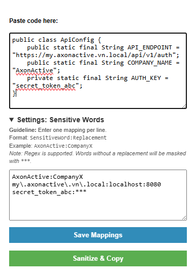

# Code Sanitizer 🛡️

A Chrome Extension that instantly sanitizes sensitive code and text before you paste it into an AI prompt or public forum.



## 🚀 Quick Setup

1. **Clone Repo:** `git clone https://github.com/vqhuy0925/sanitizer-extension.git`
2. **Open Extensions:** Go to `chrome://extensions/`
3. **Developer Mode:** Toggle **ON** (top right)
4. **Load Extension:** Click **Load unpacked** and select the cloned folder

## 🎮 How to Use

1. Click the **Code Sanitizer** icon in your Chrome toolbar.
2. Open **Settings** and input your mappings (one per line, format `Sensitive Word:Replacement Word`).
3. Paste your raw code.
4. Click **Sanitize & Copy** to get your safe code!

\*Note: Regex is supported. Words without a replacement default to `***`.\*

## 💡 Example

**Settings:**

```text
AxonActive:CompanyX
my\.axonactive\.vn\.local:localhost:8080
secret_token_abc
```

**Before:**

```java
public class ApiConfig {
    public static final String API_ENDPOINT = "https://my.axonactive.vn.local/api/v1/auth";
    public static final String COMPANY_NAME = "AxonActive";
    private static final String AUTH_KEY = "secret_token_abc";
}
```

**After (Sanitized & Copied!):**

```java
public class ApiConfig {
    public static final String API_ENDPOINT = "https://localhost:8080/api/v1/auth";
    public static final String COMPANY_NAME = "CompanyX";
    private static final String AUTH_KEY = "***";
}
```
